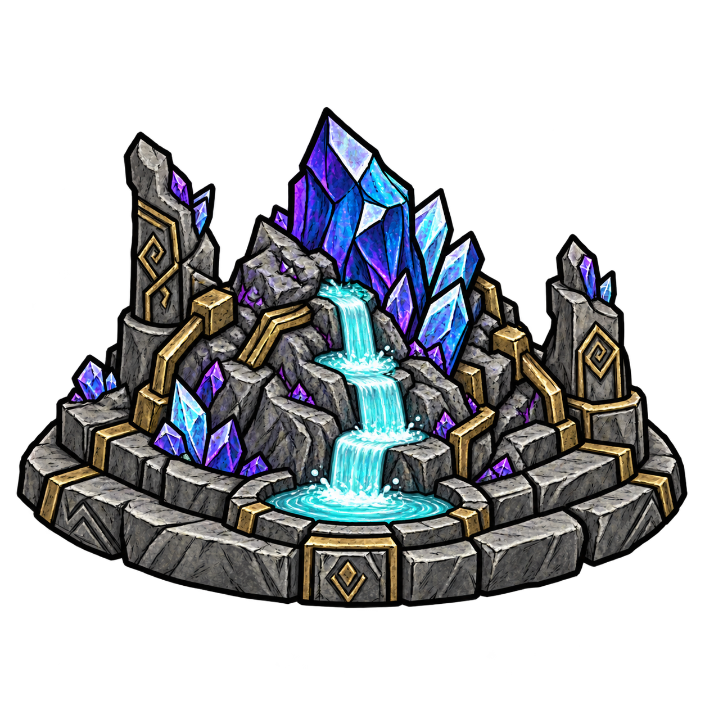

# Mỏ tự nhiên và Linh Tuyền Cực Phẩm

## Linh Tuyền Cực Phẩm — công trình nhân tạo

`ttk_spirit_workshop` thay thế ba công thức mỏ nhân tạo cũ. Công trình tồn tại nguyên vẹn sau khi bấm **Thu hoạch**, không cần cuốc, không đào cạn.

- Mọi nhân vật chế tạo tại Máy Luyện Kim: **20 Đá Cắt + 6 Ván Gỗ + 2 Ngọc Tím + 5 Trung Phẩm + 1 Thượng Phẩm Linh Thạch**.
- Sau khi đặt, chờ **5 ngày game** (2.400 giây máy chủ hoạt động) để có đợt đầu.
- Mỗi lần thu hoạch: **20 Hạ Phẩm + 2 Trung Phẩm**, **20% cơ hội thêm 1 Thượng Phẩm**. Nhận vào túi; túi đầy thì rơi dưới đất theo cơ chế game.
- Sau thu hoạch bắt đầu chu kỳ 5 ngày tiếp theo. Khi đã sẵn sàng, giữ một đợt chờ thu; không tích lũy nhiều đợt khi bỏ quên.
- Công trình sáng và có ánh xanh khi sẵn sàng; trầm màu khi đang sản xuất. Hình dáng nguyên vẹn ở cả hai trạng thái.
- Lưu/tải giữ thời gian còn lại hoặc đợt đã sẵn sàng. Thời gian chạy khi máy chủ hoạt động, kể cả khi đi xa; không tăng tốc vào mùa xuân. Tắt máy chủ thì dừng.
- Chưa có thao tác di dời/đập búa; không giải cấu bằng trượng.

### Hình ảnh mới

Thiết kế dựa trên mỏ tuyệt phẩm `xd_rock3`: nền đá xám, bệ đá hai tầng, trụ khắc, đai kim loại và tinh thể xanh–tím. Dòng linh tuyền xanh ngọc chảy từ cụm tinh thể trên cao, qua các bậc đá xuống hồ nhỏ ở mặt trước. Sprite PNG nền trong suốt được tạo bằng ImageGen tích hợp, sau đó biên dịch sang texture/animation Klei. Hình công trình, hình xem trước và icon đều dùng thiết kế mới.

Nguồn: `assets/source/ttk_spirit_workshop_spring.png`; prompt: `assets/source/ttk_spirit_workshop_spring.prompt.md`. Bộ biên dịch `tools/build_spirit_workshop_assets.py` giữ nguyên tranh nguồn, chỉ chuyển định dạng/kích thước bằng TextureConverter; hoạt ảnh là sprite tĩnh, trạng thái sản xuất thể hiện bằng màu và ánh sáng.

### Tương thích save trước

Các mỏ `ttk_rock1/2/3` **đã chế tạo và đặt xuống ở bản cũ** tự chuyển thành Linh Tuyền Cực Phẩm tại vị trí cũ khi tải save. Mỏ đang hồi giữ thời gian còn lại (lần đầu có thể dài hơn 5 ngày); mỏ đang khai thác được chuyển sang một đợt sẵn sàng. Mỗi mỏ cũ chuyển một lần. Các chu kỳ sau dùng 5 ngày.

## Mỏ tự nhiên — giữ nguyên

Prefab `ttk_rock1`, `ttk_rock2`, `ttk_rock3` giữ hình ảnh gốc, khai thác bằng cuốc. Đào hết biến mất, không hồi tại chỗ. Mỏ chưa đào vẫn tồn tại qua mùa.

| Mỏ | Lượt công cơ bản | Sản lượng |
|---|---|---|
| Thường | 6 | 3 Đá + 1 Đá Lửa + 3 Hạ Phẩm; 50% thêm 1 Hạ Phẩm |
| Hiếm | 6 | 3 Đá + 1 Đá Lửa + 1 Trung Phẩm |
| Tuyệt phẩm | 12 | 3 Đá + 1 Thượng Phẩm |

- Mục tiêu ban đầu: **24 mỏ** (16 thường, 6 hiếm, 2 tuyệt phẩm), kể cả khi thêm mod vào save cũ chưa có mỏ.
- Mỗi mùa mới thêm tối đa **12 mỏ** (8 thường, 3 hiếm, 1 tuyệt phẩm); tải lại cùng mùa không sinh thêm.
- Khoảng 2/3 lượt chọn điểm gần các khu `Rocky` / `Dig that rock`, 1/3 ở các khu khác trên đất liền. Cấp mỏ xáo ngẫu nhiên. Thiếu một nhóm vùng thì dùng nhóm còn lại.
- Không sinh ở hang động/vùng đảo đặc biệt; tránh nước, hố, công trình, cổng, người chơi và thực thể đang chiếm chỗ. Không thay thế đá/vàng gốc.
- Có thể sinh ít hơn mục tiêu nếu thiếu vị trí an toàn. Log ghi số thực tế. Mỏ chưa đào có thể tích lũy qua nhiều mùa.

## Kiểm tra

- `tools/test_spirit_workshop.py`: Pickable/Timer thật của DST; đặt/chờ/thu hoạch, nhiều cấp sản phẩm, không thu lặp, chu kỳ tiếp, lưu/tải hai trạng thái, ranh giới client, chuyển ba cấp mỏ cũ và giữ mỏ tự nhiên.
- `tools/test_spirit_mines.py`: khai thác mỏ tự nhiên, sinh lần đầu, chuyển mùa, chống trùng khi tải lại, tỷ lệ cấp mỏ và vị trí an toàn.
- `tools/spirit_mines_smoke.lua`: thử trên máy chủ riêng với save kiểm thử có ba mỏ nhân tạo của phiên bản trước, rồi chạy lại để xác nhận lưu/tải. Không dùng save người chơi.
- Kiểm thử máy chủ không thay thế kiểm tra trực tiếp hình ảnh/thao tác bằng client đồ họa.

Đã xác nhận trên máy chủ DST build 747465: chuyển ba mỏ nhân tạo cũ, nạp công thức/hình đặt/hoạt ảnh mới, sản xuất rồi thu đúng 20 Hạ Phẩm + 2 Trung Phẩm, không thu lặp và không hoàn nguyên liệu chế tạo khi thu hoạch. Bộ kiểm thử Lua sử dụng Pickable, Timer và LootDropper thật của game; đã đạt cả lưu/tải và chuyển mỏ cũ. Ảnh nguồn và alpha được kiểm tra, chưa kiểm tra bố cục công trình trên client đồ họa.

Khởi động lại máy chủ cũng đạt `TTK_MINE_RELOAD_PASS`: công trình giữ thời gian sản xuất, không xuất hiện lại mỏ nhân tạo kiểu cũ, vẫn đúng 24 mỏ tự nhiên của thế giới kiểm thử.

Sau khi đổi tên thành **Linh Tuyền Cực Phẩm** và thêm suối: đã giải mã lại texture 1024px và icon 128px để kiểm tra hình, chiều ảnh và nền trong suốt; xác nhận gói animation chứa đúng texture mới. Máy chủ DST nạp save với ảnh mới, nạp hình đặt, hoàn tất sản xuất/thu hoạch đúng 20 Hạ Phẩm + 2 Trung Phẩm và giữ 24 mỏ tự nhiên. Bộ kiểm thử Lua và audit tài nguyên đều đạt. Dòng suối hiện là tranh tĩnh; chưa xác nhận kích thước/vị trí hiển thị trực tiếp trên client đồ họa.
